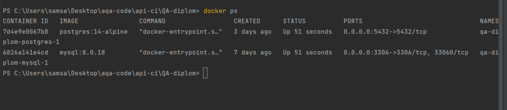

# QA-diplom
# Дипломный проект профессии «Тестировщик»

Дипломный проект представляет собой автоматизацию тестирования комплексного сервиса, взаимодействующего с СУБД и API
Банка.

## Документация

[Дипломное задание](https://github.com/netology-code/qa-diploma)

[План автоматизации тестирования веб-формы сервиса покупки туров интернет-банка](documentation/Plan.md)

[Отчёт о проведенном тестировании](documentation/Report.md)

[Отчёт о проведённой автоматизации](documentation/Summary.md)

## Запуск приложения

Перед запуском необходимо выполнить следующие предусловия. Если у вас уже есть необходимое ПО, то понадобится только п.1 и запуск Docker.

*Предусловия:*
1. Необходимо склонировать репозиторий или скачать архив по [ссылке](https://github.com/Ekaterina1705/QA-diplom). Или воспользоваться VCS Git, встроенной в
   IntelliJ IDEA.
2. Установить и запустить Docker Desktop. Это можно сделать [здесь](https://docs.docker.com/get-docker/) в зависимости от операционной системы. Дополнительные инструкции по установке Docker [ссылке](https://github.com/netology-code/aqa-homeworks/blob/master/docker/installation.md)
3. Открыть проект в IntelliJ IDEA

### Запуск

1. Запустить необходимые базы данных (MySQL и PostgreSQL). Параметры для запуска хранятся в
   файле `docker-compose.yml`. Для запуска необходимо ввести в терминале команду:

> * `docker-compose up `

2. В новой вкладке терминала ввести следующую команду:

> * `java -jar artifacts/aqa-shop.jar`

3. Проверка работающих контейнеров:

> * `docker ps`

> 

4. Приложение должно запуститься по адресу

> * `http://localhost:8080/`
 
## Запуск автотестов

1. Для запуска автотестов необходимо открыть новую вкладку терминала и ввести следующую команду:
> * `./gradlew clean test`

## Запуск отчета тестирования

1. Для запуска и просмотра отчета по результатам тестирования, с помощью "Allure", выполнить по очереди команды:
> * `./gradlew allureReport`
> * `./gradlew allureServe`

## Завершения работы Sut 

1. Для завершения работы SUT, необходимо в терминале, где был запущен SUT, ввести команду:
> * `Ctrl+C`

## Остановка и удаление контейнера
1. Для остановки работы контейнеров "Docker-Compose", необходимо ввести в терминал следующую команду: 

> * `docker-compose down`
